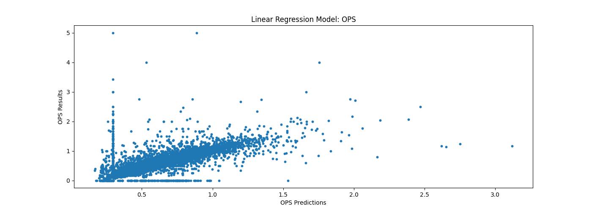
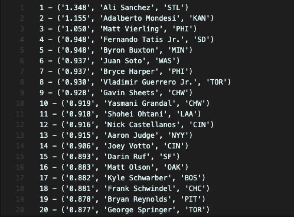

# Fantasy Baseball Predictor

# Setup

- Clone the repo
- Run `pip install -r requirements.txt`
- Run the main script, `python3 main.py`

Let me know of any issues or suggestions you have!

# Inspiration

For the last year or so I've been messing around with fantasy sports, in particular, fantasy baseball. There's just been one problem.
_I suck at it_
No matter how hard I've tried, I can't seem to pinpoint which players are hot and which players aren't. I typically don't have much time to spend researching in depth stats for every player in the MLB every day, so I decided to train a model that would do the work for me.

# What does it accomplish?

Because I mainly had difficulty picking which batters to start on a given day, I focused on them for this project. There are so many different stats in baseball that judge a player's ability to hit, with some stats recently becoming more popular than others. I decided to go with **OPS** (On Base + Slugging Percentage). I won't get into how the stat is calculated in depth now, but if you're interested, [this link](https://towardsdatascience.com/stats-for-baseball-fans-the-single-metric-for-offense-is-ops-fc568af5e87b) is a good place to start.

I also wanted to take into account how volatile a player's stats can be on any given day. Instead of making a predictions based on a player's previous game, I decided to take an average of their last 2 games to eliminate as many random "lucky" games as possible

The stats I chose to average were:

- At Bats (AB)
- Runs (R)
- Hits (H)
- Runs Batted In (RBI)
- Walks (BB)
- Strikeouts (SO)
- Plate Appearences (PA)
- Batting Average (BA)
- On Base Percentage (OBP)
- Slugging Percentage (SLG)
- On Base + Slugging Percentage (OPS)
- Win Percnetage Added (WPA)
- Average Leverage Index (aLI)
- Win Probability Added (WPA+)
- Win Probability Subtracted (WPA-)
- Base-Out Runs Added (RE24)

Note that these stats were measured on a **per game** basis

# How Was It Done?

The program essentially consists of a Python script that runs daily and does different tasks depending on the data the user has collected by previously running the script before.

I decided to scrape data from [Baseball Reference](https://www.baseball-reference.com), which conveniently holds every MLB game's stats from the 1900's. For starters, I used BeatifulSoup to scrape every game over the past three seasons (just over 100000 data points), which was sufficient for what I wanted to do. The data was filtered, cleansed, and organized into two dataframes using Pandas and NumPy. One dataframe housed the basic game stats for every game played, and the other housed the previous 2 day averages for each game, sorted alphabetically by player.

After this data was compiled, I trained the model (using Scikit Learn) with the inputs being the 2 day averages, and the output being the OPS the player accumulated for that game. A linear regression algorithm was used, which gave these results:

Using the built in score tool (and my own observations), the model tends to have an accuracy between **65 - 70 percent**, depending on the input data.

After the model is created, the script then collects averages from the most recent 2 games each MLB player has played, runs it through the model, and the results are ranked and outputted into a tect file, like so:

# How Was It Done?

The main challenge I had was figuring out how to deal with the volatility of an MLB player's stat line from game to game. Trying to find outliers in data and predict trends was difficult, and it was even more difficult taking that info and creating organized and usable dataframes.

# What Could I Have Done Better?

- Filtering bad stat lines. Some players had inflated OPS's because they came in for 1 AB and did a lot of damage, but were historically bad players. Other times historically good players were hurt and were subbed off early, negatively impacting their OPS and their rank on the output file
- Using different algorithms. Being my first data analysis related project under a limited time constraint, I really only studied and used the linear regression algorithm. In the future, I want to take a look neural networks and compare their effiency to more simple algorithms

# Sources

I took a look at various articles/videos with regards to how the linear regression algorithm works. In terms of project guidance and inspiration I mainly relied on these two articles from Samuel Mohebban:

- [Data Collection](https://medium.com/@HeeebsInc/using-machine-learning-to-predict-daily-fantasy-basketball-scores-part-i-811de3c54a98)
- [Algorithms](https://medium.com/the-sports-scientist/using-ai-to-hack-your-fantasy-lineup-2fe022886769)
